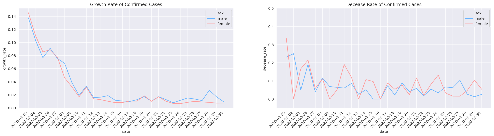
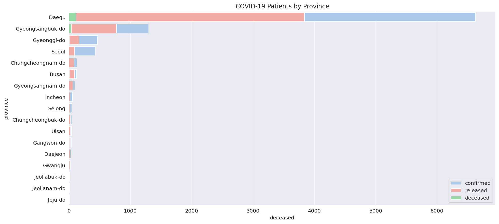
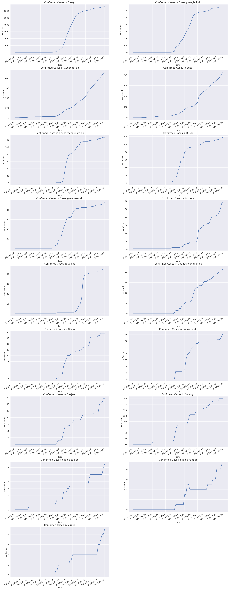
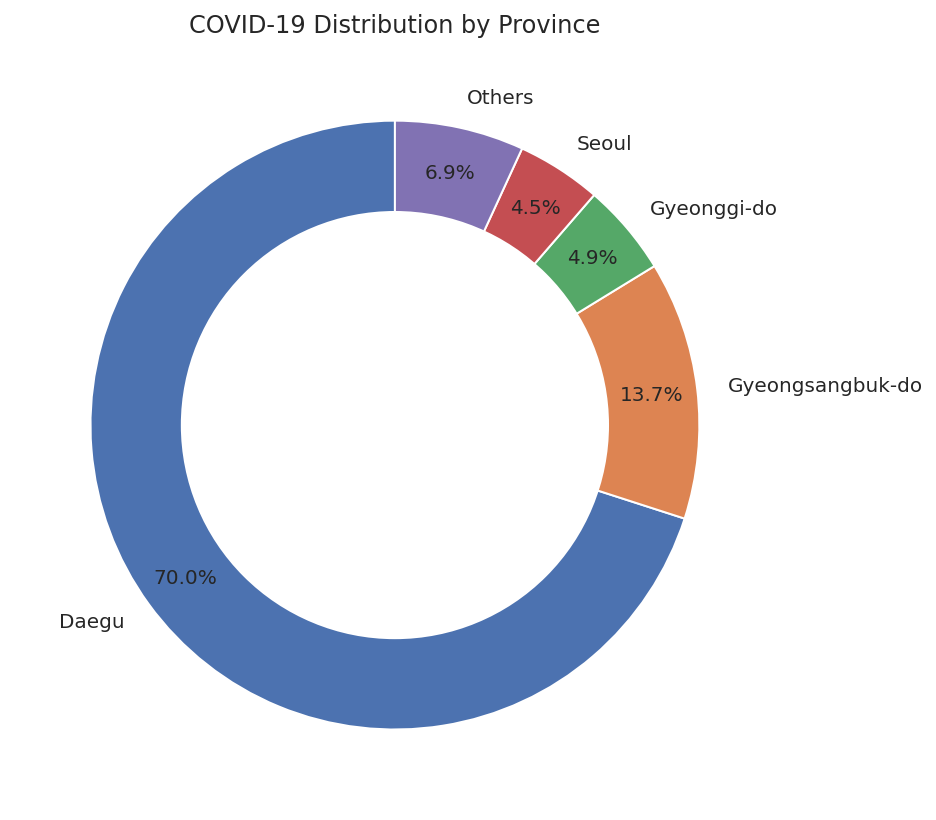

# covid-19-analysis-kr

[](https://github.com/hwuiwon/covid-19-analysis-kr/blob/master/LICENSE)

This repository is a analysis and visualization of COVID-19 Pandemic spread in South Korea.

# Dataset

[COVID-19 in South Korea Dataset by DS4C](https://www.kaggle.com/kimjihoo/coronavirusdataset)

*   **Case.csv** (Data of COVID-19 infection cases)
*   **PatientInfo.csv** (Epidemiological data of COVID-19 patients)
*   **PatientRoute.csv** (Route data of COVID-19 patients)
*   **Region.csv** (Location and statistical data of the regions)
*   **SearchTrend.csv** (Trend data of the keywords searched in NAVER which is one of the largest portals)
*   **SeoulFloating.csv** (Data of floating population in Seoul, South Korea (from SK Telecom Big Data Hub))
*   **Time.csv** (Time series data of COVID-19 status)
*   **TimeAge.csv** (Time series data of COVID-19 status in terms of the age)
*   **TimeGender.csv** (Time series data of COVID-19 status in terms of gender)
*   **TimeProvince.csv** (Time series data of COVID-19 status in terms of the Province)
*   **Weather.csv** (Data of the weather in the regions)

Dataset consists of time-series data from March 2, 2020 to March 30, 2020.

# Installation

* Clone this repository:  
```console
git clone https://github.com/hwuiwon/covid-19-analysis-kr.git
```
or click `Download ZIP` in right panel of repository and extract it.
* Open latest version of notebook in **Jupyter Notebook** or **Google Colab**.

# Features

* Several visualizations of a time-series dataset of covid19 cases in South Korea
* Detailed Analysis of data

# Visualization Preview





